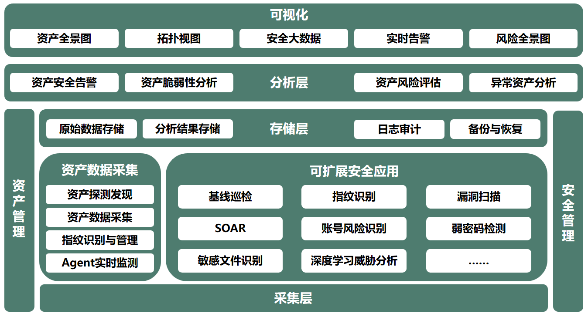
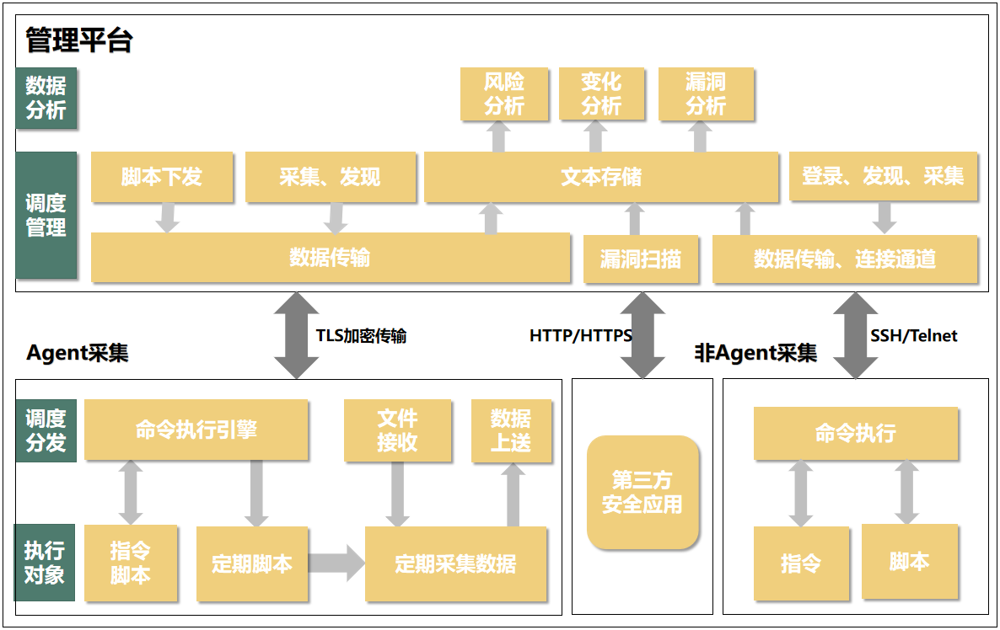
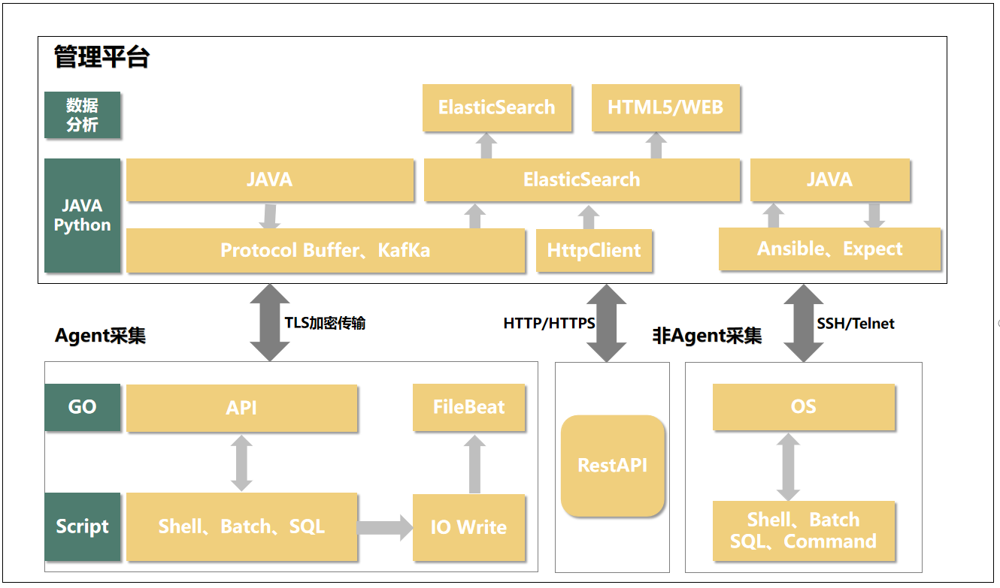
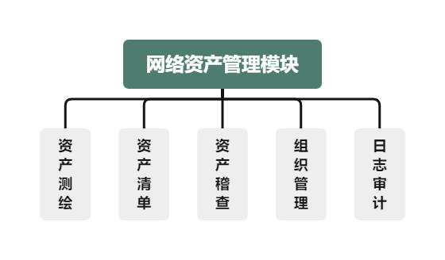
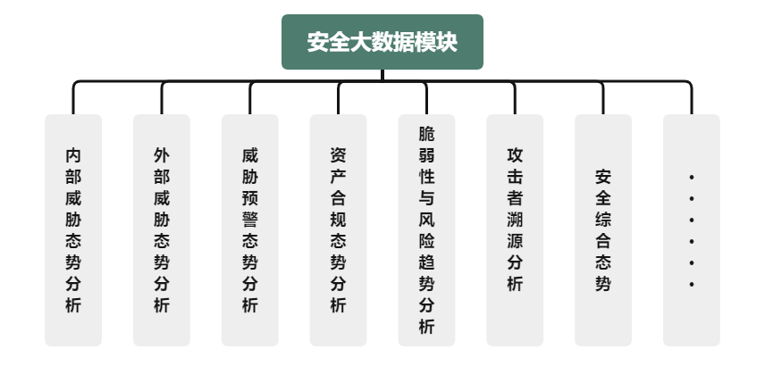

<h1 style="text-align: center">Know 安全态势感知系统</h1>

### 项目简介
Know 是一款通过整合网络空间资产安全管理、安全应用（漏洞扫描、基线巡检等）、安全大数据等服务模块，来实现对网络信息资产及网络信息资产脆弱性进行多角度、全生命周期的分析与管理的安全态势感知系统。

古语有云“酌古准今，见微知着”，Know 将以发现可预见的趋势，创造有意义的价值为目标，打造更有意义的开源安全产品。
Know-backend 是 Know 的后端工程，基于 Spring Boot 2.6.3 、 Spring Boot Jpa、 JWT、Spring Security、Redis、ElasticSearch 等技术构建。

### 项目源码

|        | 后端源码                              | 前端源码                                  | 引擎源码                                  |
| ------ | --------------------------------- | ------------------------------------- | ------------------------------------- |
| github | https://github.com/Foleyzhao/know-backend | https://github.com/Foleyzhao/know-front | https://github.com/Foleyzhao/know-arm |

### 技术选型

#### 功能架构

#### 技术架构

#### 优势亮点

- 强大的安全能力
- 对接海量第三方安全应用
- 安全数据分析快速精确

### 系统功能

#### 模块划分
- **网络资产管理模块**：

  “网络资产管理模块”为整个系统提供基础的平台管理功能：资产测绘、资产清单、资产稽查、组织管理、日志审计等。同时，“网络资产管理模块”以网络资产为核心，对给定网络环境进行资产测绘，能够全方位地发现网络资产及其资产指纹，做到帮助客户摸清家底，根据客户实际业务场景对资产进行流程化的在线管理。这一步是网络资产安全管理的基础。
 
  
- **可扩展的安全应用模块**：

  “可扩展安全应用模块”提供插拔式的安全能力，平台内置提供了如漏洞扫描、基线巡检、威胁流量检测、性能检测、弱密码检测、非法工具、非法端口、环境变量检测、版本检查、国产化率、IPV6覆盖率、老旧设备、敏感文件、补丁核查、备案信息检测等一系列安全能力。同时，我们的系统支持通过API和WebDriver这两种方式对接第三方安全应用，用户也可以按照平台安全应用的插件规范来编写自定义插件完成个性化需求。
 
  
- **安全大数据模块**：

  “安全大数据模块”对安全应用产生的安全数据进行聚合、数据清洗，通过抽取、对比、转化等操作，实现数据的预处理；接着采用智能大数据分析与建模技术，打破传统固定阈值和维度，使用具有自学习能力的模型和算法，将网络行为特征数据标签化；最后引入机器学习算法，根据安全分析模型与安全数据分析规则，进行外部威胁态势分析、内网威胁态势分析、威胁预警趋势分析、资产合规态势分析、资产脆弱性与风险趋势分析、攻击者溯源分析等操作。最终通过安全综合态势呈现给客户。
  
  

#### 项目结构

#### know-backend
后端项目采用按功能分模块的开发方式，结构如下

- `common` 为系统的公共模块，包含工具类，公共配置

- `system` 为系统核心模块，包含全部的业务模块：资产发现、资产采集、漏洞扫描等

- `logging` 为系统的日志模块

- `tools` 为第三方工具模块，包含本地存储及邮件等

### 功能截图

### 反馈交流
#### 微信
（添加好友请备注说明）

